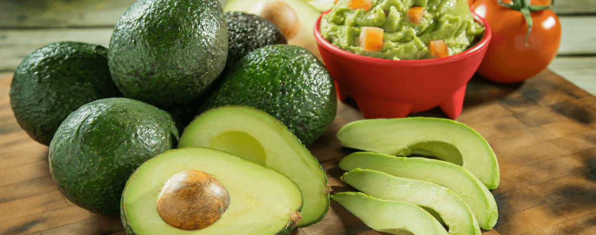

<div id="top"></div>

<!-- PROJECT LOGO -->
<br>
<div align="center">
  <a href="https://bitbucket.org/robertofierimonte/avocados-technical-task/">
    
  </a>

<h2 align="center">Avocados Technical Task</h2>
  <p>Technical task about building a simple ML model in Numpy and a Flask Rest API for CRUD operations.<br>
  Author: <a href="mailto:roberto.fierimonte@gmail.com"><b>Roberto Fierimonte</b></a></p>
</div>

<!-- TABLE OF CONTENTS -->
 <h3 align="center">Table of Contents</h3>
 <ol>
 <li>
  <a href="#about-the-project">About the Project</a>
 </li>
 <li>
  <a href="#getting-started">Getting Started</a>
  <ul>
   <li><a href="#prerequisites">Prerequisites</a></li>
   <li><a href="#repo-structure">Repo structure</a></li>
   <li><a href="#local-setup">Local setup</a></li>
   <li><a href="#container-orchestration">Container orchestration</a></li>
  </ul>
 </li>
 <li><a href="#using-the-api">Using the API</a></li>
 <li><a href="#running-the-ml-model">Running the ML model</a></li>
</ol>

<!-- ABOUT THE PROJECT -->
## About the Project

Generic takehome task for a Data Science / Machine Learning Engineer position.

<u>Requirements</u>:

1. Create a linear regression model estimating the function `y=f(x)` that represents the price of Avocados based on historical data. Furthermore, information related to the features that most drive this change in price should be pointed out.

    This should be done using only numpy and basic python - i.e not using higher-level packages. Basic machine learning consideration when preprocessing and handling data need to be taken into consideration. Lines of code should be commented thoroughly to show understanding.

    [Link to dataset](​https://drive.google.com/file/d/1rhRzA2s44I8ASm_bMHnCpmAz_mNJQ7M3/view?usp=sharing)

2. Using python and Flask construct a REST API about recipes.

    a. Create a few tables in a mysql database that has recipe information and recipe ingredients.

    b. Create an API to:

      * Get, edit, delete and create recipes.
      * Get recipes by certain `ingredient_name`

    <br/> Good python techniques should be used, especially regarding the design of the API. Furthermore, some error handling is also expected.

Please note that the two tasks are independent and can be tested and executed independently.

<p align="right">(<a href="#top">back to top</a>)</p>

## Getting Started

### Prerequisites
- Python 3.9 (we are using version `3.9.7`)
- [poetry](https://python-poetry.org/) (we are using version `1.2.2`)
- [pre-commit](https://pre-commit.com/)
- [Docker](https://www.docker.com/) (must have suppport for Docker Compose `v3` - we are using version `20.10.21`)
- [MySQL](https://www.mysql.com/) (optional for local testing - we are using version `8.0.31`)

### Repo structure

```
avocados-technical-task
├── api_examples
├── containers
├── data
├── docs
├── model
├── notebooks
├── scripts
└── src
     ├── api
     └── base
```

- The `api_examples` folder contains some `.json` files that can be used to test the API
- The `containers` folder contains the Dockerfile used to build the image for the Flask App
- The `data` folder is empty and it will be populated with the dataset after completing the local setup
- The `docs` folder contains the documentation about the project
- The `model` folder is empty and it will be populated with the serialised ML model files after running the training notebook
- The `notebooks` folder contains the notebooks for exploratory analysis over the data, as well as the training and testing of the model
- The `scripts` subfolder contains the script to initialise the MySQL database, as well as a function to clean the recipe name before feeding it to the API
- The `src` folder contains the source code for the project:
   - The `api` subfolder contains the code to run the Flask App
   - The `base` subfolder contains the code used for the exploratory analysis, data preprocessing, and ML model

### Local setup

In the repository, execute:

1. Install poetry if not available: `pip install poetry==1.2.2`
2. Install the required dependencies: `poetry install`
3. Install pre-commit hooks: `poetry run pre-commit install`
4. Download the dataset by running `make download-data`
5. Follow the instructions in the `.env.example` to set up the necessary environment variables
6. Run `make help` to see all the options provided in the Makefile

To run the code locally (on your machine):

7. Run `make mysql-local-setup` to initialise the MySQL database
8. Run `make run-server-local` to run the Flask App

Reference to section <a href="#using-the-api">Using the API</a> for more info on how to use the API.

<p align="right">(<a href="#top">back to top</a>)</p>

### Container Orchestration

Alongside running the API locally we provide the option to use Docker compose to host both the API and the MySQL database on containers. We do this through [Docker Compose](https://docs.docker.com/compose/). You can find the configuration for the systems in the [docker-compose.yml](./docker-compose.yml) file.

We defined two containers to be used in this application - the first container hosts the MySQL database and the second container hosts the Flask App. The App container is dependent on the MySQL container to be healthy before being spun up. Also the two containers will share a network. The Docker application can be built by running `make build-compose` (before starting it up for the first time or when changes are made to it), started by running `make run-compose`, and stopped by running `docker compose down`. After starting the application for the first time (or if you have deleted the database volume - see below) run `make mysql-setup-docker` to instantiate the database, tables, and triggers. This steps solves the issue of the syntax for MySQL triggers causing an error when trying to initiate the database using the native docker entrypoint.

The MySQL container uses a volume to persist the database, so that when the containers are shut down the database is restore and available for future sessions. To delete the volume at the same time of stopping the application, run `docker compose down -v`. **N.B.: this will remove all the tables** and you'll have to re-create them using the `make mysql-setup-docker` command before being able to use the API again.

<p align="right">(<a href="#top">back to top</a>)</p>

### Using the API

The API provides the following entry-points:

| HTTP Method | Entrypoint                               | Make Command                                                  | Notes                                            | Response codes             |
|-------------|------------------------------------------|---------------------------------------------------------------|--------------------------------------------------|----------------------------|
| GET         | `/recipes`                               | `make get-all-recipes`                                        |                                                  | 200 Success                |
| GET         | `/recipes/<recipe-name>`                 | `make get-recipe-by-name recipe=<recipe-name>`                |                                                  | 200 Success, 404 Not Found |
| POST        | `/recipes/<recipe-name>`                 | `make post-recipe-by-name recipe=<recipe-name>`               | Need `api_examples/post_<recipe-name>.json` file | 201 Created, 400 Bad Request, 409 Conflict |
| PUT         | `/recipes/<recipe-name>`                 | `make put-recipe=by-name recipe=<recipe-name>`                | Need `api_examples/put_<recipe-name>.json` file  | 200 Success, 400 Bad Request, 404 Not Found |
| DELETE      | `/recipes/<recipe-name>`                 | `make delete-recipe-by-name recipe=<recipe=name>`             |                                                  | 200 Success                |
| GET         | `/ingredients`                           | `make get-all-ingredients`                                    |                                                  | 200 Success                |
| GET         | `/ingredients/<ingredient-name>/recipes` | `make get-recipes-by-ingredient ingredient=<ingredient-name>` |                                                  | 200 Success, 404 Not Found |

A description for all the previous commands is also available by running `make help`.

When running the commands from the Makefile, first the `<recipe-name>` and the `<ingredient-name>` will be cleaned by making them lowercase, removing all alphabetical characters, and replacing whitespaces with underscores. This is done by running the [clean_string.py](./scripts/clean_string.py) script on the string. Afterwards, in case of POST or PUT requests related to a recipe, a `.json` file will be looked in the `api_examples` folder corresponding to the cleaned `<recipe-name>` and that will be passed as a payload to the API call.

For example, when running the command `make post-recipe-by-name recipe="Risotto gorgonzola, pears, and walnuts"`, the `<recipe-name>` will be cleaned to become `risotto_gorgonzola_pears_walnuts`, a file `post_risotto_gorgonzola_pears_walnuts.json` will be looked up inside [the `api_examples` folder](./api_examples/) and it will be used as the payload for the request to create the new recipe.

Of course you can also make a request pointing to a different file or alternatively using a `json` payload directly from Postman.

<p align="right">(<a href="#top">back to top</a>)</p>

### Running the ML Model

A trained model is not provided with this repository. To train the model please the [training notebook](notebooks/1-eda-model.ipynb) end to end. That will save the model in the [model](model/) folder for it to be used to predict on new data.

<p align="right">(<a href="#top">back to top</a>)</p>
